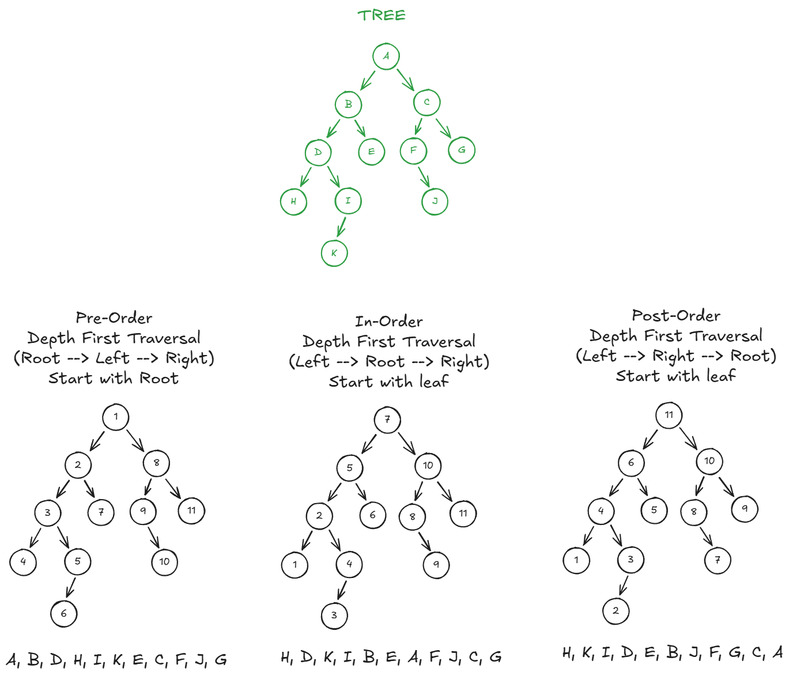

<script id="MathJax-script" async
    src="https://cdn.jsdelivr.net/npm/mathjax@3/es5/tex-mml-chtml.js">
</script>
## Page Contents

- [Introduction](#introduction)
- [When Do You Use It?](#when-do-you-use-it)
- [The Rules](#the-rules)
- [Examples](#examples)
  - [Countdown](#countdown)
  - [Factorial](#factorial)
- [Aside: Let's Build a RecursionTracer Class!](#aside-lets-build-a-recursiontracer-class)
- [Another Example: Fibonacci Sequence](#another-example-fibonacci-sequence)
- [Optimising: Memoisation](#optimising-memoisation)
  - [Counting Leaf Items in a Nested List](#counting-leaf-items-in-a-nested-list)
  - [Fibonacci](#fibonacci)
- [Traversal Examples](#traversal-examples)
  - 
  - [Calculating the Next Term in an Nth-Degree Arithmetic Progression](#calculating-the-next-term-in-an-nth-degree-arithmetic-progression)
- [AoC Examples](#aoc-examples)

## Introduction

I have to admit, I used to struggle with recursion.  A lot of people do.  It can be a bit mind-bending. But it's a pretty simple concept and can be very useful.

In short: **a recursive function is a function that calls itself.**  Thus, the code that defines the function will include a call to the same function.

As an anology, take a look at examples of recursive acronyms.  See how the acronym definition includes the acronym itself!

|Acronym|Definition|
|-------|----------|
|GNU| = GNU's not Linux|
|LAME| = LAME Ain't an MP3 Encoder|
|YAML|  YAML Ain't Markup Lanugage|

## When Do You Use It? 

Typical use cases include:

- Any time you need to calculate the _next_ value of something, based on the _current_ value of something using a self-referential definition. For example:
  - Factorial, which we can define as `f(k) = k * f(k-1)`
  - The Fibonacci sequence, we can define as `f(k) = f(k-1) + f(k-2)`
- Any time we need to traverse a tree structure. Including the Depth-First Traversal algorithm.
- Any time we need to traverse a nested structure.

We'll look at example of these in a bit.

## The Rules

When creating a recursive function, there are three that must always be followed:

1. The function must have an _exit condition_, called the _base case_. You need this, otherwise your recursive function will never end!
1. The function must call itself.
1. Each recursive call should move us closer to the base case.

## Examples

### Countdown

Let's start with a super-simple case: a recursive function that counts down from an arbitary number `n` to 0.  We can do it like this:

```python
def countdown(n):
    print(n)
    if n == 0: # Base case - we've finished
        return             
    else:
        countdown(n - 1)   # Recursive call, one closer to the base case
```

As per the rules:

- We've defined a base condition.  I.e. when we get to 0, we exit.
- It calls itself.
- The recursive call always moves us closer to the base condition. In this case, by decrementing the value of `n` each time by 1.

We can simplify this code:

```python
def countdown(n):
    print(n)
    if n > 0:
        countdown(n - 1)   # Recursive call, one closer to the base case
```

Let's try it.  I've added the above code to a file called scratch.py, in my snippets folder. I'll now execute it from the Python REPL:

```python
>>> from snippets.scratch import *
>>> countdown(5)
5
4
3
2
1
0
```

### Factorial

Recall the defition of factorial:

\\(k! = k * (k-1)\\)

This is slightly tricker than the previous example, since we're not just printing a value with each iteration.  Instead, we're always multiplying the current iteration by the result of the previous iteration.

So we can code it like this:

```python
def factorial(n):
     return 1 if n <= 1 else n * factorial(n - 1)
```

- The base condition is when `n == 1`.  In this situation, `factorial` should always return 1.
- If not the base condition, we always multiply by a recursive call where `n` is decremented by 1.

Note that it's common for any recursive function that calculates a _product_ to have an exit condition that returns 1.

We can see how function works by adding some debugging statements:

```python
def factorial(n):
    print(f"factorial() called with n = {n}")
    return_value = 1 if n <= 1 else n * factorial(n -1)
    print(f"-> factorial({n}) returns {return_value}")
    return return_value
```

Let's run it from the REPL:

```text
>>> from snippets.scratch import *
>>> factorial(4)
factorial() called with n = 4
factorial() called with n = 3
factorial() called with n = 2
factorial() called with n = 1
-> factorial(1) returns 1
-> factorial(2) returns 2
-> factorial(3) returns 6
-> factorial(4) returns 24
24
```

Note how each `return` is the product of `n` and the previous return value.

## Aside: Let's Build a RecursionTracer Class!

```python
class RecursionTracer():
    """ 
    A decorator class to trace the execution flow of recursive functions.

    The `RecursionTracer` class wraps a recursive function and prints its calls
    and returns with indentation that reflects the depth of recursion. This makes it
    easier to understand the behavior of the recursive function, including the
    "winding" (function calls) and "unwinding" (return values).

    Args:
        func (Callable): The recursive function to be wrapped for tracing.
    """
    FILL = '|   '
    
    def __init__(self, func: Callable):
        """ Initializes the `RecursionTracer` for a recursive function.
        Args:
            func (Callable): The recursive function to wrap and trace.
        """        
        self._original_func = func  # Store a reference to the original function
        self._func_name = func.__name__
        self._func = func
        self._recursion_depth = 0
    
    def __call__(self, *args, **kwargs):
        # Print function call
        if self._recursion_depth == 0:
            print(f'{self._func_name}({", ".join(map(str, args))})')
        else:
            print(f'{RecursionTracer.FILL * (self._recursion_depth - 1)}' +
                  f'|-- {self._func_name}({", ".join(map(str, args))})')

        # Recurse
        self._recursion_depth += 1
        res = self._func(*args, **kwargs)      
        self._recursion_depth -= 1
        
        # Print return value
        print(f'{RecursionTracer.FILL * self._recursion_depth}└--> {res}')
            
        return res

    def enable_tracing(self) -> Callable:
        """ 
        Enables tracing by wrapping the function for recursive call tracing. 
        Returns the traced function reference.
        Tracing must be explicitly enabled using this method 
        when not using the `@RecursionTracer` decorator.
        """
        if not isinstance(self._func, RecursionTracer):
            self._func = RecursionTracer(self._func)
            
        return self._func

    def disable_tracing(self) -> Callable:
        """
        Disables tracing and returns the original unwrapped function.
        """
        self._func = self._original_func
        return self._original_func
```

Now we can trace our `factorial()` function like this:

```python
tracer = RecursionTracer(factorial)
factorial = tracer.enable_tracing()
print("Tracing enabled:")
factorial(5)
factorial = tracer.disable_tracing()
```

And the output looks like this:

```text
Tracing enabled:
factorial(5)
|-- factorial(4)
|   |-- factorial(3)
|   |   |-- factorial(2)
|   |   |   |-- factorial(1)
|   |   |   |   └--> 1
|   |   |   └--> 2
|   |   └--> 6
|   └--> 24
└--> 120
120
```

Cool right? This might be useful for debugging and understanding your own recursive solutions.

## Another Example: Fibonacci Sequence

The Fibonacci sequence is an infinite sequence that generates the next number by adding the two preceding numbers.

`1, 1, 2, 3, 5, 8, 13, 21...`

I.e. to determine the `nth` value in the sequence:

\\(f(n) = f(n-2) + f(n-1)\\)

The base case is where `n` is `1`, which returns a value of `1`.

```python
def fib(nth: int) -> int:
    """ Recursive function to determine nth value of Fibonacci sequence.
    I.e. 1, 1, 2, 3, 5, 8, 13, 21...
    fib(n) = fib(n-2) + fib(n-1)
    """
    if nth < 1: # So we can also handle negative
        return 0
    if nth == 1:
        return 1
    
    return fib(nth-1) + fib(nth-2)
```

Let's run it:

```python
for i in range(-3, 40):
    print(f"{i}: {fib(i)}")
```

And the output...

```text
-3: 0
-2: 0
-1: 0
0: 0
1: 1
2: 1
3: 2
4: 3
5: 5
6: 8
7: 13
8: 21
9: 34
10: 55
...
```

This is fine, but if you run this, you'll find it takes a minute or so to compute the 40th term. So this solution is not scaling!!

Time to add a common recursion optimisation: memoisation!

## Optimising: Memoisation

Certain recursive functions can be hugely inefficient in terms of redundant trees of calculations. For example the `fib()` function is described as having complexity `O(2^n)`, meaning that its complexity (and therefore time requirement) grows exponentially with each additional term. Urgh.

Let's have a look at how many calls are actually required for each successive term of our `fib()` function:

```python
class FibCallTracker:
    def __init__(self):
        self.calls = 0  # Local to the wrapper

    def fib(self, n: int) -> int:
        self.calls += 1
        
        if n < 1:
            return 0
        if n == 1:
            return 1
        return self.fib(n - 1) + self.fib(n - 2)

for i in range(1, 31):
    fib_tracker = FibCallTracker()
    res = fib_tracker.fib(i)
    print(f"{i=}, {res=}, {fib_tracker.calls=}")
```

And we get:

```text
i=1, res=1, fib_tracker.calls=1
i=2, res=1, fib_tracker.calls=3
i=3, res=2, fib_tracker.calls=5
i=4, res=3, fib_tracker.calls=9
i=5, res=5, fib_tracker.calls=15
i=6, res=8, fib_tracker.calls=25
i=7, res=13, fib_tracker.calls=41
i=8, res=21, fib_tracker.calls=67
i=9, res=34, fib_tracker.calls=109
i=10, res=55, fib_tracker.calls=177
i=11, res=89, fib_tracker.calls=287
i=12, res=144, fib_tracker.calls=465
i=13, res=233, fib_tracker.calls=753
i=14, res=377, fib_tracker.calls=1219
i=15, res=610, fib_tracker.calls=1973
i=16, res=987, fib_tracker.calls=3193
i=17, res=1597, fib_tracker.calls=5167
i=18, res=2584, fib_tracker.calls=8361
i=19, res=4181, fib_tracker.calls=13529
i=20, res=6765, fib_tracker.calls=21891
i=21, res=10946, fib_tracker.calls=35421
i=22, res=17711, fib_tracker.calls=57313
i=23, res=28657, fib_tracker.calls=92735
i=24, res=46368, fib_tracker.calls=150049
i=25, res=75025, fib_tracker.calls=242785
...
i=27, res=196418, fib_tracker.calls=635621
i=28, res=317811, fib_tracker.calls=1028457
i=29, res=514229, fib_tracker.calls=1664079
i=30, res=832040, fib_tracker.calls=2692537
```

So you can see the number of calls growing exponentially.

But here's the cool thing: we can cache every unique `fib()` call. And in Python, this is so easy to implement: we just use the `@cache` decorator to our function!

```python
class FibCallTracker:
    def __init__(self):
        self.calls = 0  # Local to the wrapper

    @cache # THIS IS THE ONLY CHANGE TO ENABLE CACHING!
    def fib(self, n: int) -> int:
        self.calls += 1
        
        if n < 1:
            return 0
        if n == 1:
            return 1
        return self.fib(n - 1) + self.fib(n - 2)

for i in range(1, 31):
    fib_tracker = FibCallTracker()
    res = fib_tracker.fib(i)
    print(f"{i=}, {res=}, {fib_tracker.calls=}")
```

And here's the output:

```text
i=1, res=1, fib_tracker.calls=1
i=2, res=1, fib_tracker.calls=3
i=3, res=2, fib_tracker.calls=4
i=4, res=3, fib_tracker.calls=5
i=5, res=5, fib_tracker.calls=6
i=6, res=8, fib_tracker.calls=7
i=7, res=13, fib_tracker.calls=8
i=8, res=21, fib_tracker.calls=9
i=9, res=34, fib_tracker.calls=10
i=10, res=55, fib_tracker.calls=11
i=11, res=89, fib_tracker.calls=12
i=12, res=144, fib_tracker.calls=13
i=13, res=233, fib_tracker.calls=14
i=14, res=377, fib_tracker.calls=15
i=15, res=610, fib_tracker.calls=16
i=16, res=987, fib_tracker.calls=17
i=17, res=1597, fib_tracker.calls=18
i=18, res=2584, fib_tracker.calls=19
i=19, res=4181, fib_tracker.calls=20
i=20, res=6765, fib_tracker.calls=21
i=21, res=10946, fib_tracker.calls=22
i=22, res=17711, fib_tracker.calls=23
i=23, res=28657, fib_tracker.calls=24
i=24, res=46368, fib_tracker.calls=25
i=25, res=75025, fib_tracker.calls=26
...
i=27, res=196418, fib_tracker.calls=28
i=28, res=317811, fib_tracker.calls=29
i=29, res=514229, fib_tracker.calls=30
i=30, res=832040, fib_tracker.calls=31
```

Much better!

So let's compare the number of calls with caching compared to without:

| n | Total Number of Function Calls | Calls with Memoisation |
| - | - | - |
| 1 | 1 | 1 |
| 2 | 3 | 3 |
| 3 | 5 | 4 |
| 4 | 9 | 5 |
| 5 | 15 | 7 |
| 10 | 177 | 11 |
| 20 | 21891 | 21 |
| 30 | 2692537 | 31 |
| 40 | 331160281 | 41 |

So whereas it took a minute or so to compute the 40th term without caching, we can now compute the 1000th term instantly, with caching. Nice!

### Calculating the Next Term in an Nth-Degree Arithmetic Progression

An arithmetic progression (AP) is a sequence of numbers in which the difference of any two successive members is a constant. This difference is commonly referred to as the _"common difference"_. For example:

```text
Progression: 0   3   6   9  12  15  18
Common diff:   3   3   3   3   3   3
```

A second-degree arithmetic progression is one in which the differences between terms is growing, but growing by a constant amount. Thus, _differences of differences_ are common:

Triangle numbers are a common example:

```text
       Progression: 1   3   6  10  15  21
          First diff: 2   3   4   5   6
Second (common) diff:   1   1   1   1
```

We can extrapolate this to the Nth Degree. I.e. the number of times you have to determine differences, before the differences are common. If you determine the number of degrees after which the differences are common, you can bubble the results back up to the top, in order to determine the next term in the sequence.

So this is a good candidate for a recursive function:

```python
def recurse_diffs(sequence: np.ndarray, forwards=True) -> int:
    """
    Calculate the next value in a numeric sequence based on the pattern of differences.

    Recursively analyses the differences between consecutive elements of the sequence. Recurses until the differences remain constant. It then calculates the next value in the sequence based on this constant difference.

    Parameters:
        sequence (np.ndarray): A NumPy array representing the sequence.
        forwards (bool, optional): A flag to determine the direction of progression.
                                   If True (default), the function calculates the next value. 
                                   If False, it calculates the previous value in the sequence.

    Returns:
        int: The next (or previous) value in the sequence
    """
    diffs = np.diff(sequence)
    
    op = operator.add if forwards else operator.sub
    term = sequence[-1] if forwards else sequence[0]
    
    # Check if all the diffs are constant
    # If they are, we've reached the deepest point in our recursion, and we know the constant diff
    if np.all(diffs == diffs[0]):
        next_val = op(term, diffs[0])
    else: # if the diffs are not constant, then we need to recurse
        diff = recurse_diffs(diffs, forwards)
        next_val = op(term, diff)
        
    return int(next_val)
```

## Traversal Examples

### Tree Traversal

A tree is an acyclic graph - i.e. one in which no loops are created - where there is only ever a single edge between a pair of nodes. An emergent property of this structure is that there is exactly one path from any node to any other node in the tree. 

- For a tree of `n` nodes there will always be `n-1` edges. This is because adding any more edges would create a cycle.
- The top node of the tree is called the _root_.
- Nodes with no child nodes are called _leaf nodes_.

Note: a _binary tree_ is a tree in which any node can have no more two children. I.e. 0, 1 or 2 children for any given node.

See [here](https://aoc.just2good.co.uk/python/graph).

Traversing trees can be done recursively because any subtree in a tree is itself just another tree. A subtree could be just a leaf node.

We can do this with a **Depth-First Search (DFS)**. We can do:

- **Pre-order traversal** - sequence is: root, left, right; start with root node. Use this when you need to inspect roots before leaves. E.g. for visualing an entire tree, or replicating a tree from the top down.
- **In-order traversal** - sequence is: left, root, right; start with first leaf. Use this when we need process nodes in a specific sequence, e.g. in binary search tree.
- **Post-order traversal** - sequence is: left, right, root; start with first leaf. Use this when you need to inspect all leaves before corresponding nodes. E.g. where we need to delete items from the bottom up. (E.g. delete the item before deleting the container for the item.)

In each case, every traversal results in the current node (if not a leaf) being treated as the current root.



Let's simulate a tree:

```python
class Node:
    def __init__(self, payload):
        self.payload = payload
        self._left = None
        self._right = None

    @property
    def left(self) -> Node:
        return self._left
    
    @property
    def right(self) -> Node:
        return self._right
    
    def set_children(self, left: Node, right: Node):
        self.set_left(left)
        self.set_right(right)
        
    def set_left(self, left: Node):
        self._left = left
    
    def set_right(self, right: Node):
        self._right = right
```

Now let's build our tree. The code below creates the tree shown in the image above.

```python
node_a = Node("A")
node_a.set_children(node_b := Node("B"), node_c := Node("C"))
node_b.set_children(node_d := Node("D"), node_e := Node("E"))
node_d.set_children(node_h := Node("H"), node_i := Node("I"))
node_i.set_left(Node("K"))
node_c.set_children(node_f := Node("F"), node_g := Node("G"))
node_f.set_right(Node("J"))
```

And now let's create our recursive function(s) to traverse the tree:

- Our base case is if the root node is None. This will happen if we've run out of nodes to traverse. In this case we just return the current path.
- Our recursive call always moves us towards the base case, by being called for a left or right child.
- Every call to the function appends to the `path` list. The `path` variable is initialised to an empty list with our very first call of the function.

```python
def pre_order_traverse(root: Node):
    """ root -> left -> right
    Here we don't pass the path in to the call. We create a new path object
    with each call, and then add it to the exising path, using extend. """
    path = []
    
    # Base case is when root is None - then we simply return the path
    if root:
        path.append(str(root.payload)) # Add current node to the path
        path += pre_order_traverse(root.left) # recurse all the way
        path += pre_order_traverse(root.right) # recurse all the way
        
    return path

def in_order_traverse(root: Node):
    """ left -> root -> right """
    path = []    
    if root:
        path += in_order_traverse(root.left)
        path.append(str(root.payload))
        path += in_order_traverse(root.right)
        
    return path

def post_order_traverse(root: Node):
    """ left -> right -> root """
    path = []
    if root:
        path += post_order_traverse(root.left)
        path += post_order_traverse(root.right)
        path.append(str(root.payload))
        
    return path

print(f"pre_order_traverse: {"-".join(pre_order_traverse(node_a))}")
print(f"in_order_traverse: {"-".join(in_order_traverse(node_a))}")
print(f"post_order_traversal: {"-".join(post_order_traverse(node_a))}")
```

And this is what you get:

```text
pre_order_traverse: A-B-D-H-I-K-E-C-F-J-G
in_order_traverse: H-D-K-I-B-E-A-F-J-C-G
post_order_traversal: H-K-I-D-E-B-J-F-G-C-A
```

Neat!

### Counting Leaf Items in a Nested List

Here we create a recursive function that counts all the individual elements in a list.  If the list is nested, the function recurses into each _sub_ list, adding the elements of that list to the overall count.

```python
def count_leaf_items(item_list):
    """Recursively counts and returns the number of leaf items
       in a (potentially nested) list. """
    count = 0
    for item in item_list:
        if isinstance(item, list): # if the element is itself a list, recurse...
            count += count_leaf_items(item)
        else: # count the item
            # this is the exit condition, i.e. when we've reached a leaf (element) rather than a nested list
            count += 1  

    return count
```

Let's try this...

```python
nested_list = [2, [3,5], [[10,20],30]]
print(nested_list)

res = count_leaf_items(nested_list)
print(res)
```

Output:

```text
[2, [3, 5], [[10, 20], 30]]
6
```

## AoC Examples

- [Recursively process json - 2015 day 12](/2015/12)
- [Recursive string replacement - 2021 day 14](/2021/14)
- [Various recursinos as methods of a class - 2021 day 16](/2021/16)
- [Recursive snail mail - 2021 day 18](/2021/18)
- [Recursive game states using dynamic programming and lru cache - 2021 day 21](/2021/21)
- [Recursive directory listing by extending the list - 2022 day 7](/2022/7)
- [Recursive `__lt__` compare - 2022 day 13](/2022/13)
- [Recursive arithmetic progressions - 2023 day 9](https://colab.research.google.com/github/derailed-dash/Advent-of-Code/blob/master/src/AoC_2023/Dazbo's_Advent_of_Code_2023.ipynb){:target="_blank"}
- [Creating a pretty print with recursion and max depth - 2024 day 24](https://colab.research.google.com/github/derailed-dash/Advent-of-Code/blob/master/src/AoC_2024/Dazbo's_Advent_of_Code_2024.ipynb){:target="_blank"}